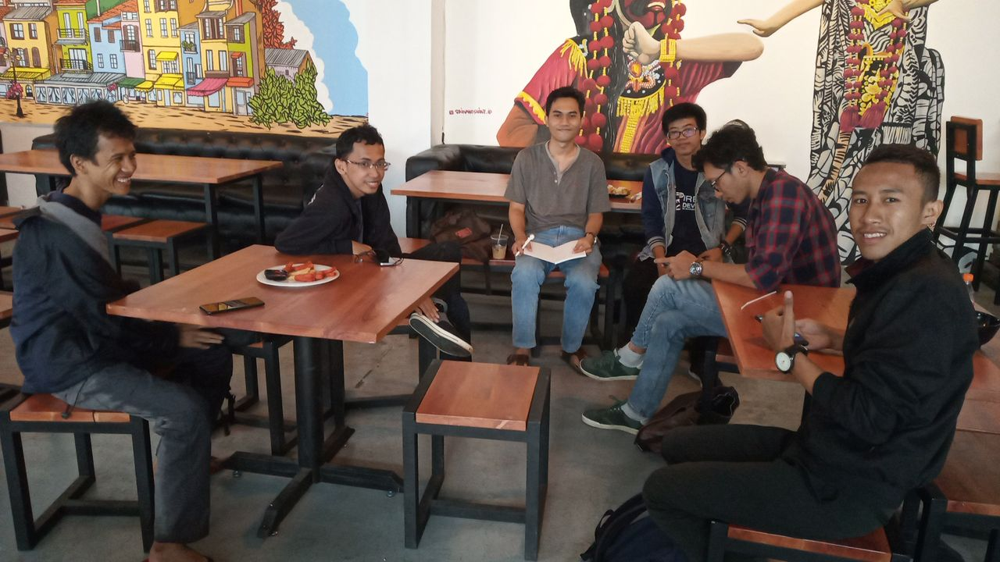
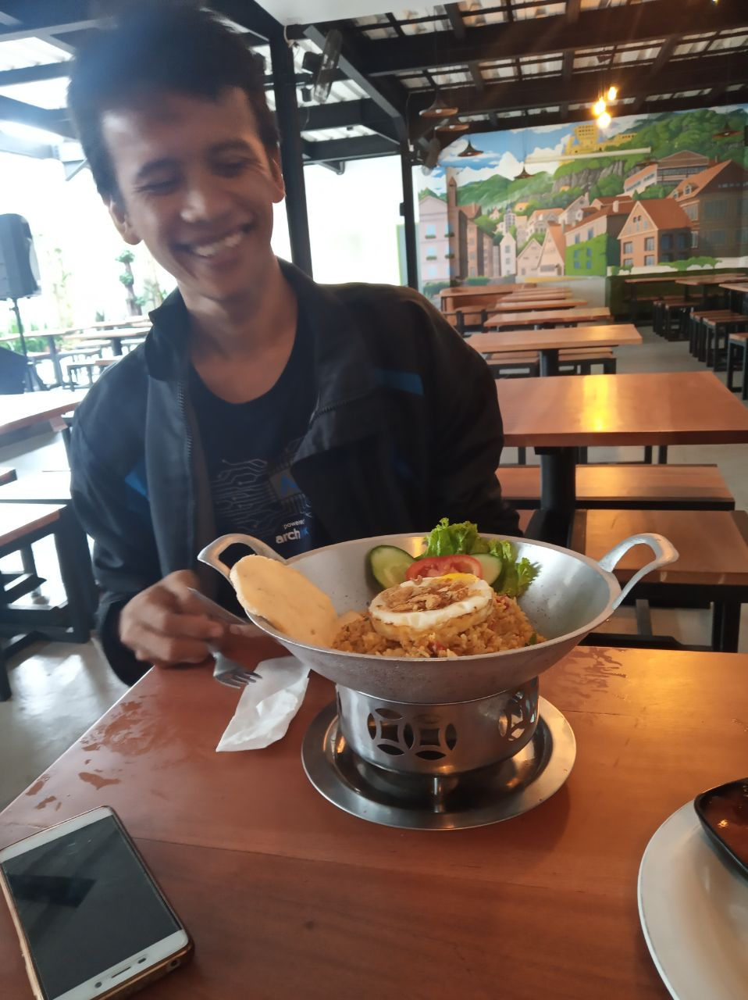
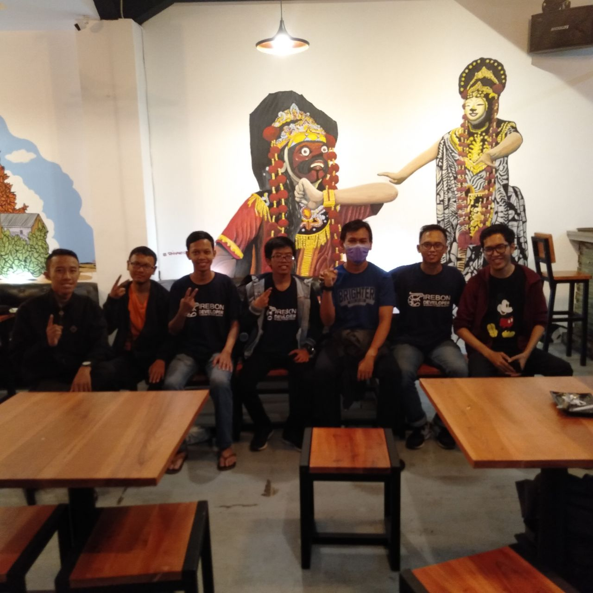
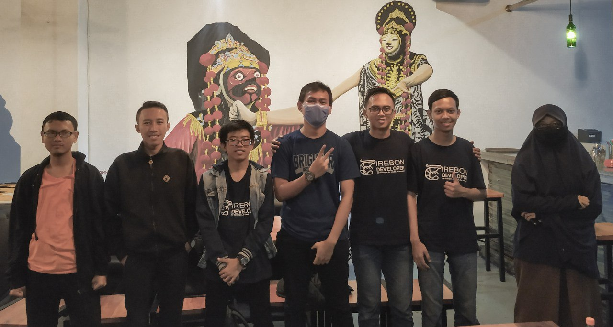
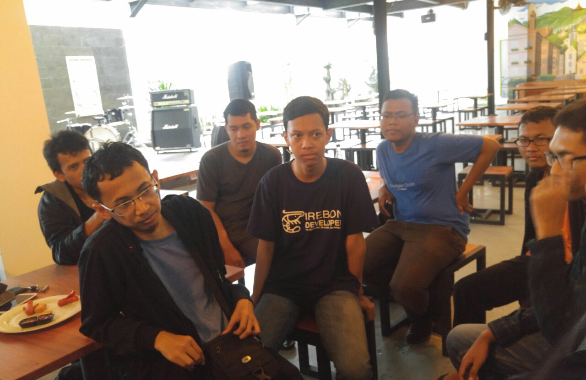

# Meeting #4

```
Warung Amare
Pukul 13:00 - 16:00
Peserta: 15 orang
```

## Bahan Diskusi

- [x] Perkenalan anggota
- [x] Review 2018
- [x] Rencana tahun 2019
- [x] PO T-Shirt Cirebon Dev part 2
- [x] Project Jamblang

## Catatan

### Review 2018

- Sharing bagaimana Cirebon Dev bisa berdiri. 

Dimulai dari kelas di SMKN 1 pada tahun 2017. Selanjutnya mulai dibuat struktur organisasi, dimana ada ketua, sekertaris, dan seterusnya. Namun, setelah dijalani ternyata sistem organisasi yang didasari struktur kurang sesuai dengan komunitas Cirebon Dev. Sehingga pada pertemuan-pertemuan selanjutnya, komunitas Cirebon Dev mengusung struktur organisasi berdasarkan event-event tertentu saja. Contohnya, pada saat Meetup, hanya ada koordinator, pemateri, dan seksi konsumsi. 

- Kegiatan di tahun 2018.

CirebonDev sudah mengadakan beberapa kegiatan.

1. Meetup #1 di Upnormal
2. Kulgram di Telegram
3. Meetup #2 tentang Flutter
4. Meetup #3 di kantor Indosystem
5. Kegiatan di Uniku
6. Meetup #4 di Warung Amare

- Masalah-masalah yang dialami di tahun 2018

1. Di pertengahan tahun 2018, kegiatan mulai minim karena kebanyakan anggota, yang masih bersekolah, sibuk menghadapi ujian dan tugas sekolah.
2. Dulu sempat ada anggota yang menyalahgunakan CirebonDev sebagai lahan untuk penjualan suatu produk saja. Sehingga kita harus mengeluarkan anggota tersebut.
3. Kita khawatir CirebonDev identik dengan Indosystem, karena kebanyakan kegiatan dilakukan oleh karyawan Indosystem dan berlokasi di kantor Indosystem (Kantor Programmer). Padahal tidak ada kerjasama komersial antara Indosystem dan CirebonDev.
4. Pada Meetup / Tech Talk, materi yang disampaikan oleh pemateri terlalu tinggi bagi para peserta. Sehingga materi yang disampaikan kurang efektif. Contohnya, pada materi seputar node.js, peserta belum memahami hal-hal seputar Ubuntu (apt-get), git, dan dasar-dasar JavaScript. Kita bisa menerapkan survey sebelum mengadakan suatu Tech Talk, untuk memahami lebih lanjut tingkat pemahaman peserta.
5. Beberapa anggota CirebonDev kini berdomisili di luar Cirebon, sehingga kesulitan untuk berkontribusi.
6. Pada suatu pertemuan, peserta menganggap seperti di-OSPEK. Meskipun, tidak ada kegiatan yang menyerupai OSPEK.
7. Kita sudah berusaha mendekati klub komputer di setiap sekolah namun masih minim respon. Sebaiknya kita coba dekati dengan mengirimkan surat terlebih dahulu ke sekolah yang dituju.

### Kegiatan Tahun 2019

1. Kulgram 2.0
2. Blog post (Medium)
3. Seminar nasional di UMC
4. Program mentorship
5. Roadshow untuk anak SMK, SMA, dan informasi lowongan pekerjaan atau magang.
6. Project Jamblang
7. Portofolio Komunitas CirebonDev
8. Proyek untuk pemilu serentak 2019

- UMC akan menyediakan tempat, namun masih kekurangan pengisi materi. Diharapkan dari CirebonDev.
- Belajar dari komunitas lain, kita harus memiliki kegiatan rutin dan target setiap tahunnya.
- Pemilu 2019 merupakan *low hanging fruit* untuk mengeksekusi suatu proyek, salah satu proyek sederhana adalah ketersediaan informasi mengenai caleg di Cirebon. Proyek yang sudah sempat dikerjakan secara *open source* adalah [proyek untuk aggregasi artikel](https://github.com/pyk/rojak) yang berkaitan tentang pilkada DKI 2017.

### PO T-Shirt Cirebon Dev part 2

Pihak panitia siap memenuhi pesanan kaos untuk Cirebon Dev. Detailnya akan dibahas dalam grup Telegram.

### Project Jamblang

Tujuan:

1. Lahan belajar
2. Showcase komunitas
3. Kegiatan bersama
4. Mempermudah laporan mengenai fasilitas umum di Cirebon

Output MVP:

1. Dashboard yang dapat diakses masyarakat umum seputar jalan yang rusak di Cirebon
2. Data jalan yang rusak diinput melalui grup Telegram atau Google Docs.

Fasilitas umum yang nantinya dicover Project Jamblang:

- Jalan
- Sampah
- Lampu
- Panggul
- Vandalisme

## TODO

- [ ] Membagikan notulensi Meetup #4
- [ ] [Verifikasi] Apakah kita bisa mendapatkan titik GPS dari EXIF?
- [ ] Membuat spesifikasi untuk MVP Proyek Jamblang
- [ ] Membuat portfolio komunitas CirebonDev
- [ ] Mencari pemateri untuk seminar di UMC

## Dokumentasi





